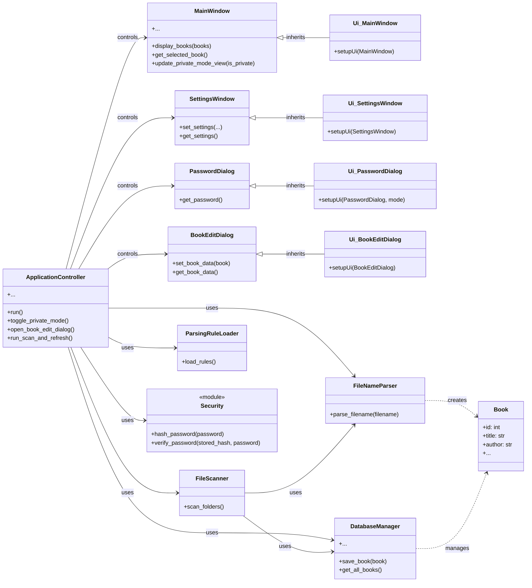

# クラス図

## 1. 概要

本ドキュメントは、蔵書管理アプリケーションの主要なクラスとその関係性を示します。
MVP (Model-View-Presenter) パターンを意識した設計となっており、UI の定義とロジックが分離されています。

## 2. クラス図

## 3. クラス詳細

### Controller

#### `ApplicationController`

アプリケーション全体の動作を制御する Presenter としての役割を担います。UI（View）からのユーザーイベントを受け取り、それに応じて Core（Model）のビジネスロジックを実行し、最終的な結果を View に表示するよう指示します。View と Model の間の仲介役として、両者が互いに直接関与しないように分離する責務を持ちます。

### View_Logic

#### `MainWindow`

アプリケーションのメインウィンドウの振る舞いを定義する View クラスです。UI の構築自体は`Ui_MainWindow`から継承し、自身はユーザー操作（ボタンクリック、検索入力など）のシグナルを`ApplicationController`に接続したり、`ApplicationController`からの指示で書籍リストの表示を更新したりするロジックを担当します。

#### `SettingsWindow`

設定ダイアログの振る舞いを定義する View クラスです。スキャン対象フォルダの追加・削除や、ビューアパスの設定といったユーザー操作をハンドリングし、最終的な設定値を`ApplicationController`に渡す責務を持ちます。

#### `PasswordDialog`

パスワード認証および設定ダイアログの振る舞いを定義する View クラスです。入力されたパスワードの検証や、`ApplicationController`への入力値の受け渡しを担当します。

#### `BookEditDialog`

書籍情報編集ダイアログの振る舞いを定義する View クラスです。既存の書籍情報をフォームに表示し、ユーザーによって編集された新しい書籍情報を`ApplicationController`に渡す責務を持ちます。

### View_Base

#### `Ui_MainWindow`, `Ui_SettingsWindow`, etc.

各 View クラスの見た目（ウィジェットの配置、レイアウト、スタイル）のみを定義するベースクラス群です。これらのクラスはロジックを一切含まず、Qt Designer で自動生成されるファイル、またはそれに準ずる手動での UI 定義ファイルとして扱われます。

### Core

#### `DatabaseManager`

SQLite データベースとのすべてのやり取りをカプセル化するクラスです。接続管理、テーブルの作成、書籍情報や設定の CRUD（作成、読み取り、更新、削除）操作といった、データベースに関するすべての責務を負います。

#### `ParsingRuleLoader`

ファイル名の解析ルールを JSON ファイルから読み込み、優先度順にソートする責務を持つクラスです。

#### `FileNameParser`

`ParsingRuleLoader`によって読み込まれたルールに基づき、ファイル名文字列を解析して`Book`オブジェクトを生成する責務を持ちます。

#### `FileScanner`

指定されたフォルダを再帰的にスキャンし、ファイルシステム上のファイルとデータベース上の書籍情報を同期させる責務を持ちます。ファイルのハッシュ値を計算し、新規、更新、削除されたファイルを検出します。

#### `Security`

パスワードのハッシュ化や検証など、セキュリティ関連のヘルパー関数を提供します。

### Models

#### `Book`

一冊の書籍に関するすべてのメタデータ（タイトル、著者、ファイルパスなど）を保持するデータクラスです。アプリケーション全体で書籍情報をやり取りする際の標準的な形式として利用されます。

### 3.1. 関係性

- `<|--`: 継承 (Inheritance) - View ロジッククラスが View 定義クラスを継承して UI を構築します。
- `-->`: 関連 (Association) - クラス間の持続的な関係（例: `ApplicationController`が`MainWindow`を制御する）。
- `..>`: 依存 (Dependency) - あるクラスが別のクラスの機能を利用する関係（例: `FileNameParser`が`Book`を生成する）。
