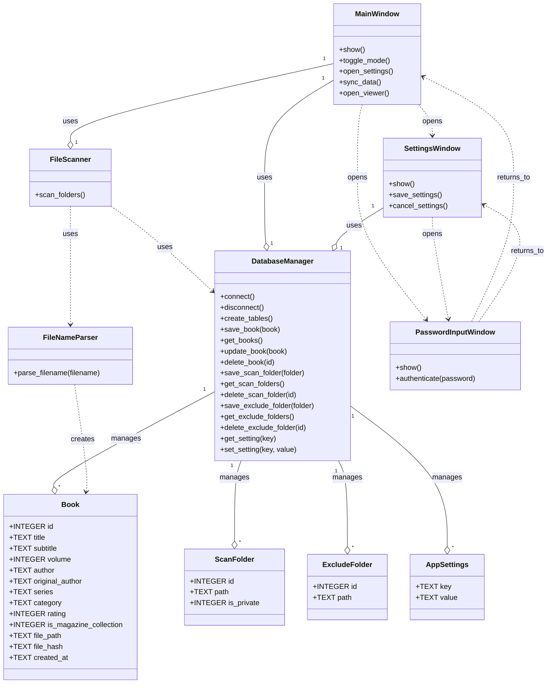

# クラス図

## 1. 概要

本ドキュメントは、蔵書管理アプリケーションの主要なクラスとその関係性を示します。Mermaid 記法を用いて記述されています。

## 2. クラス図

### 2.1. 説明

- **Book, ScanFolder, ExcludeFolder, AppSettings**: データモデルを表すクラスです。
- **DatabaseManager**: データベースとのやり取りを管理し、各データモデルの CRUD 操作を提供します。
- **FileNameParser**: ファイル名から書籍情報を解析する機能を提供します。
- **FileScanner**: 指定されたフォルダをスキャンし、ファイルシステムとデータベースの同期を行います。
- **MainWindow**: アプリケーションのメインウィンドウを管理し、主要な機能へのアクセスを提供します。
- **SettingsWindow**: アプリケーションの設定を行うウィンドウを管理します。
- **PasswordInputWindow**: パスワード入力を処理するウィンドウを管理します。

各矢印はクラス間の関係性を示します。

- `--o`: 集約 (Aggregation) - 全体と部分が独立して存在できる関係。
- `..>`: 依存 (Dependency) - あるクラスが別のクラスの機能を利用する関係。
