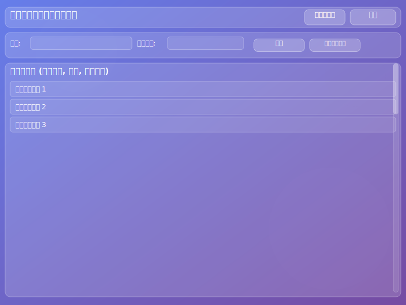
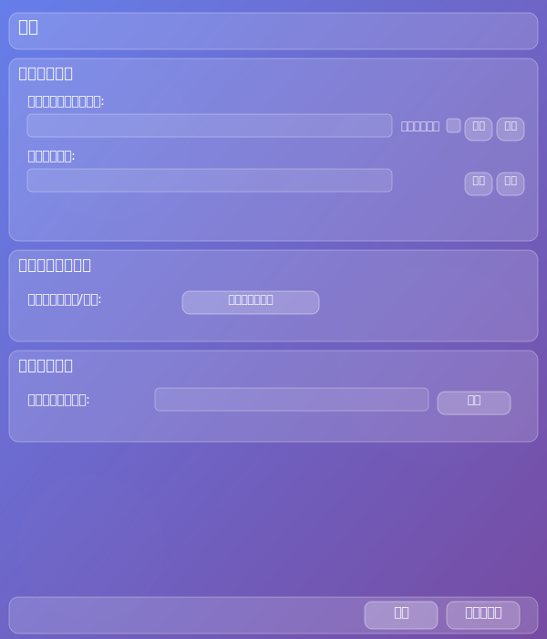
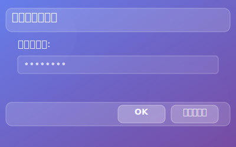

# 画面設計書

## 1.1. フォント

アプリケーション全体で使用するフォントは以下の通りです。

- **日本語フォント**: 游ゴシック、メイリオ
- **英語フォント**: Segoe UI
- **汎用フォント**: sans-serif

使用するフォントは、日本語は「游ゴシック」「メイリオ」、英語は「Segoe UI」の順で優先的に適用し、利用できない場合は `sans-serif` をフォールバックとします。

## 1.2. UI 共通ルール

- **UI デザイン**: グラスモーフィズムを採用する。
- **ボタン**: ボタン内のテキストは、水平・垂直方向ともに中央に配置する。

## 1. 概要

本ドキュメントは、蔵書管理アプリケーションの主要な画面のレイアウトと機能について記述します。

## 2. メイン画面

### 2.1. レイアウト

### 2.2. 主要コンポーネント

- **ヘッダー**: アプリケーションタイトル、モード切替ボタン、設定ボタンを配置。
  - **モード切替ボタン**: 通常モードとプライベートモードを切り替える。クリックするとパスワード入力画面へ遷移（プライベートモードへの切り替え時）。
  - **設定ボタン**: 設定画面へ遷移する。クリックするとパスワード入力画面へ遷移。
- **検索・フィルタリングエリア**: 蔵書リストの検索と並び替えを行う。
  - **検索入力フィールド**: 書籍名、著者名などで蔵書を検索。
  - **並び替えドロップダウン**: タイトル順、登録順などでリストの表示順を変更。
  - **同期ボタン**: スキャン対象フォルダを再検索し、蔵書データを同期する。
  - **ビューア起動ボタン**: 選択中の蔵書を外部ビューアで開く。
- **蔵書リストエリア**: データベースに登録された蔵書の一覧を表示する。
  - 各行には書籍タイトル、著者、巻数などの主要情報が表示される。
  - 選択した蔵書の詳細情報表示や編集機能への連携が想定される。

### 2.3. 画面遷移

- **モード切替ボタン (プライベートモードへ)** → パスワード入力画面 → メイン画面 (プライベートモード)
- **設定ボタン** → パスワード入力画面 → 設定画面
- **蔵書リストの項目選択** → (詳細表示/編集画面へ遷移、またはコンテキストメニュー表示)

## 3. 設定画面

### 3.1. レイアウト

### 3.2. 主要コンポーネント

- **フォルダ管理セクション**: スキャン対象フォルダと除外フォルダの設定を行う。
  - **スキャン対象フォルダリスト**: 登録されたフォルダパスを表示。各項目に「プライベート」属性のチェックボックス。
  - **追加/削除ボタン**: フォルダパスの追加・削除ダイアログを開く。
  - **除外フォルダリスト**: 登録された除外フォルダパスを表示。
- **セキュリティ設定セクション**: パスワードの設定・変更を行う。
  - **パスワード変更ボタン**: パスワード設定/変更ダイアログを開く。
- **ビューア設定セクション**: 外部ビューアのパスを設定する。
  - **外部ビューアパス入力フィールド**: 外部ビューアの実行ファイルパスを表示・編集。
  - **参照ボタン**: ファイル選択ダイアログを開き、ビューアパスを選択。
- **保存/キャンセルボタン**: 設定の保存または破棄。

### 3.3. 画面遷移

- **設定画面へのアクセス** → パスワード入力画面 → 設定画面
- **保存ボタン** → メイン画面
- **キャンセルボタン** → メイン画面

## 4. パスワード入力画面

### 4.1. レイアウト

### 4.2. 主要コンポーネント

- **パスワード入力フィールド**: パスワードを入力する。入力内容はマスクされる。
- **OK ボタン**: 入力されたパスワードで認証を試みる。
- **キャンセルボタン**: 入力をキャンセルし、元の画面に戻る。

### 4.3. 画面遷移

- **OK ボタン (認証成功)** → メイン画面 (プライベートモード) または、設定画面
- **OK ボタン (認証失敗)** → エラーメッセージ表示、パスワード入力画面に留まる
- **キャンセルボタン** → メイン画面 (通常モード) または、設定画面を開く前の画面
