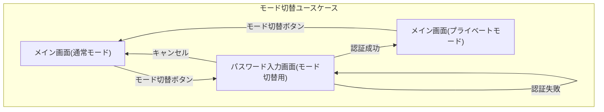
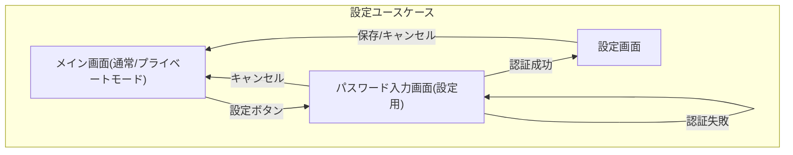

# 画面遷移図

## 1. 概要

本ドキュメントは、蔵書管理アプリケーションの主要な画面間の遷移を、ユースケースごとに記述します。

## 2. 画面遷移 (ユースケース別)

### 2.1. ユースケース: モード切替

### 2.2. ユースケース: 設定

### 2.3. 説明

- **メイン画面 (通常モード)**: アプリケーション起動時の初期画面です。
- **メイン画面 (プライベートモード)**: パスワード認証成功後に切り替わるモードです。
- **パスワード入力画面 (モード切替用)**: モード切替時に表示されるパスワード入力画面です。
- **パスワード入力画面 (設定用)**: 設定画面へのアクセス時に表示されるパスワード入力画面です。
- **設定画面**: アプリケーションの設定を行う画面です。

各矢印は画面間の遷移を示し、ラベルは遷移のトリガー（ボタン操作など）を表します。
