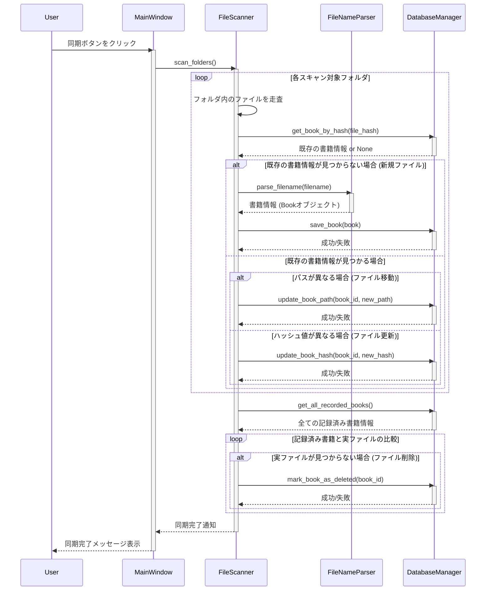

# シーケンス図

## 1. 概要

本ドキュメントは、蔵書管理アプリケーションの主要な機能におけるオブジェクト間のメッセージのやり取りと時間的な順序を示します。

## 2. 蔵書データの登録と同期処理

### 2.1. 説明

- **User**: アプリケーションの利用者です。
- **MainWindow**: アプリケーションのメインウィンドウです。同期処理のトリガーとなります。
- **FileScanner**: ファイルシステムを走査し、ファイルとデータベースの同期ロジックを管理します。
- **FileNameParser**: ファイル名から書籍情報を抽出する役割を担います。
- **DatabaseManager**: データベースへのアクセスと操作を管理します。

このシーケンス図は、ユーザーが同期ボタンをクリックしてから、ファイルのスキャン、解析、データベースの更新、そして結果の通知までの一連の流れを示しています。
